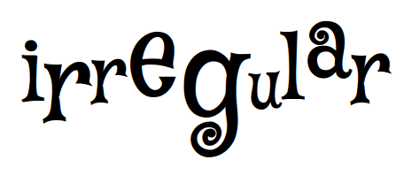
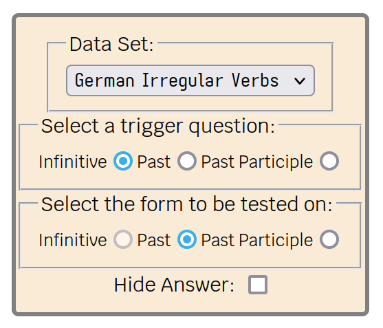
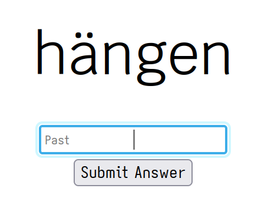
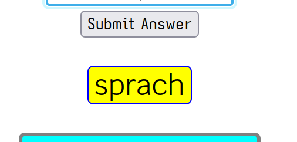
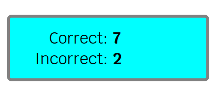
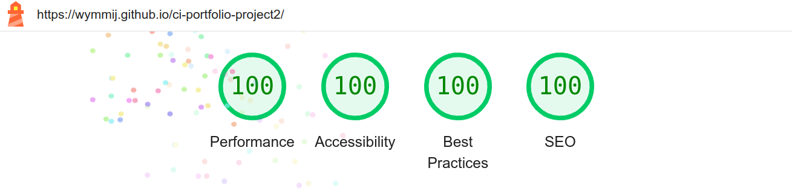

# irregular

irregular is primarily for language learners. Many, if not most, languages have some grammatical patterns that are irregular in their formation, and often the words formed are amongst the most frequently encountered words of the language; indeed it is probably their very frequency that has meant they haven't yet yielded to a regular pattern formation. There's no way around it then - these irregular forms just have to be learnt. Or rather; they have to be _absorbed_ to the point that their use is effortless. As is usually the case with language, mastery will come with time and effort, but that doesn't mean that areas of this process can't be expedited. Mastery of the irregular forms is one such area.

The purpose of the site is to provide quick-fire drills of the irregular formations. A ‘trigger’ prompt question is given and the requested pattern is typed in as answer. So, for example, an infinitve form of an irregular verb is presented as the prompt question and the user must type in the corresponding past participle, say, of that verb.

## Features

### Existing Features

- **Site Title**
  - The site is ‘irregular’ and the title is _irregular_; all lower case and with character baselines that vary.
  - A playful font ‘Mystery Quest’ should reinforce the irregular nature of the site

- **Configuration Area**
  - The user has various configuration options to choose from.
    - The data set to be drilled on. Here a choice between German and English irregular verb conjugation.
    - The trigger question. For both verb conjugations this one of infinitive, (simple) past and past participle.
    - The answer form to be tested on. The same forms as the question part, but with the currently selected trigger question disabled.
    - The option to hide display of the incorrect answer. An extra layer of difficulty, perhaps to give the user another chance to think of the correct answer

- **Question and Answer Area**
  - The trigger question's font size is prominent and large.
  - The body font (‘Krub’) is used due to its clear legibility.
  - The answer input has the cursor centrally placed. This is part of the wider design goal of the site that everything is oriented to the centre of the screen.
  - The placeholder text of the answer input serves as a reminder of the form that is being tested on. It disappears as soon as the user starts to type.
  - The user can also press the `Return` key on the keyboard, which is particularly useful for the user so they don't have to be keep moving their hand between keyboard and mouse - a frequent source of frustration.

- **Incorrect Answers**
  - Incorrect answers are displayed just the below the submit button.
  - It's prominently coloured with a yellow background and blue border.
  - To facilitate a style of drilling quickly through each question, the incorrect answer only displays for 1.5 seconds before disappearing.

- **Score Area**
  - The area is panelled off with an aqua coloured background to make it prominent, but not too prominent.
  - The score digits are centrally alligned to ensure all the information can easily be seen at a glance.

### Features Left to Implement

- A mode that makes the selection of the question and answer forms random also. This would make the site a more useful tool for language learners.
- The ability for a user to upload their own irregular data patterns.
- A way to include regular grammatical patterns also. This would serve as a contrast to the irregular pattern and could be tested on intermittently as a sort of ‘red-herring’ test.

## Testing

### Browsers

- Chrome
- Firefox
- Qutebrowswer
- Nyxt

#### Issues

The functionality and appearance of the site was consistent and unproblematic across all the browsers tested.

### Validator Testing

- HTML
  - Warnings were initially given when passing through the official [W3C validator](https://validator.w3.org/nu/?doc=https%3A%2F%2Fwymmij.github.io%2Fci-portfolio-project2%2F)
    These were closing forward slashes on various tags that the beautifier had added.
  - Also two errors about name attributes on div elements that I corrected and removed.
- CSS
  - No errors. [(Jigsaw) validator](https://jigsaw.w3.org/css-validator/validator?uri=https%3A%2F%2Fwymmij.github.io%2Fci-portfolio-project2%2F&profile=css3svg&usermedium=all&warning=1&vextwarning=&lang=en)
- Lighthouse
  - Warnings but no errors initially. Some input elements needed a corresponding label for screen readers. None were required really, but I ultimately found a solution by using aria attributes.
  - Finally, I got perfect results from lighthouse!

### Unfixed Bugs

None I'm aware of.

## Deployment

Initially, I deployed the site on my local machine and ran on an `apache` server while I played around with a few ideas.

Later I deployed the site using **GitHub Pages**: [https://wymmij.github.io/ci-portfolio-project2/index.html](https://wymmij.github.io/ci-portfolio-project2/index.html)

- The steps to deploy are as follows:
  - On the GitHub repository, go to the Settings tab
  - Select ‘Pages’ on the menu on the left under ‘Code and automation’
  - Make sure the ‘main’ branch is selected and that the /(root) folder is also selected
  - Deployment should take a few minutes or so.

## Credits

- I was also working through the first ten chapters of ‘JavaScript: The Definitive Guide’ (7th Edition) by David Flanagan and published by O'Reilly, while doing this project.
